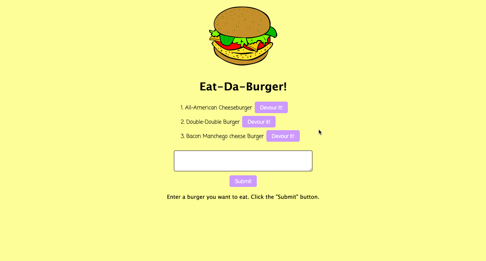
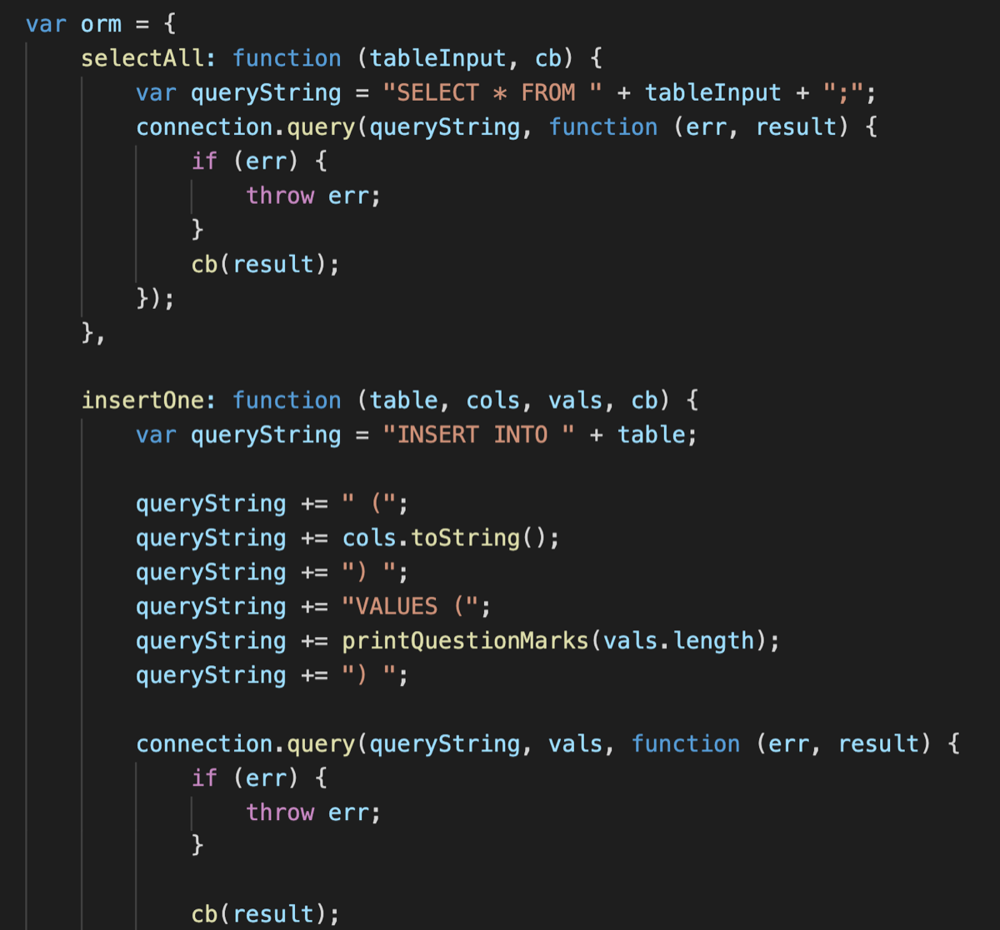
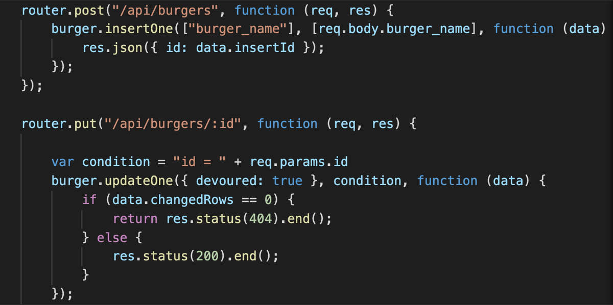

# Burger

A burger logger built with MySQL, Node, Express, Handlebars and a homemade ORM. Eat-Da-Burger! is a restaurant app that lets users input the names of burgers they'd like to eat and keep track of their burger intake.

## Technologies Used

* MySQL
* Node.js & JavaScript
* Express
* Handlebars
* homemade ORM (to retrieve and store data in our database)
* Heroku

## Walk-through GIF

## Essential Code

Self-built ORM with methods to select, insert, and update values within the database:

API endpoints to `create` (post) new burgers and `udpate` the state of the burger to 'devoured' upon clicking the 'Devour it!' button:

## Links

[Burger App - Heroku](https://shielded-anchorage-21706.herokuapp.com/)

[My LinkedIn](https://www.linkedin.com/in/leticiaroncero/?locale=en_US)

[Professional Portfolio](https://leticiaroncero.github.io/Responsive-Portfolio/portfolio.html)
